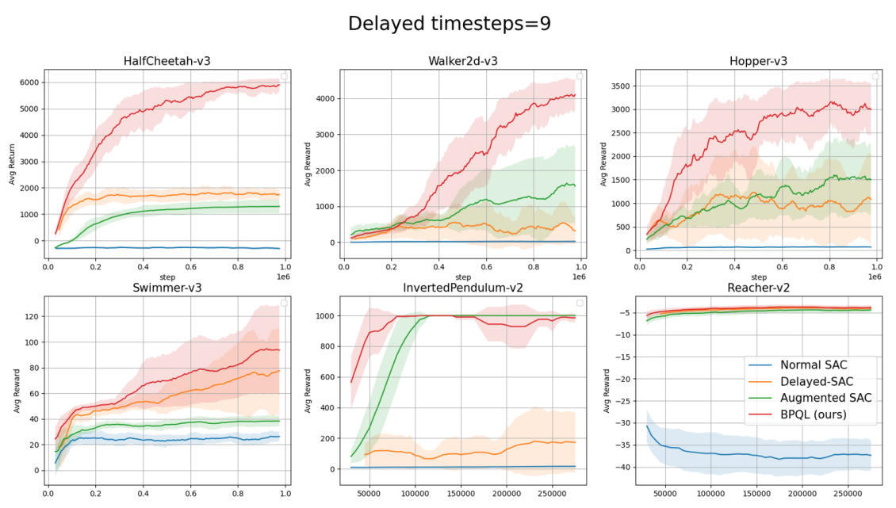

<div align="center">
  <h1>Belief Projection-Based Q-Learning</h1>
  <a href="https://www.python.org/">
    
  </a>
  &nbsp;&nbsp;
  <a href="https://pytorch.org/">
    
  </a>
  &nbsp;&nbsp;
  <a href="https://proceedings.neurips.cc/paper_files/paper/2023/hash/0252a434b18962c94910c07cd9a7fecc-Abstract-Conference.html">
    
  </a>
</div>

## [NeurIPS 2023] Official Implentation of Belief Projection-Based Q-Learning (BPQL)
This repository contains the PyTorch implementation of **BPQL** introduced in the paper: **_Belief Projection-Based Reinforcement Learning for Environments with Delayed Feedback_** by Jangwon Kim et al., presented at Advances in Neural Information Processing Systems (NeurIPS), 2023.


## 📄 Paper Link
>You can see the paper here: https://proceedings.neurips.cc/paper_files/paper/2023/hash/0252a434b18962c94910c07cd9a7fecc-Abstract-Conference.html


## 🚀 Achieves S.O.T.A. Performance, Yet Very Simple to Implement

* **Supports both observation delay, action delay, and their combination**
* **Performance Plot ⬇️**
<p align="center">
  
</p>


## ▶️ How to Run?
### Option 1: Run the script file 
```
>chmod +x run.sh
>./run.sh
```

### Option 2: Run main.py with arguments
```
python main.py --env-name HalfCheetah-v3 --random-seed 2023 --obs-delayed-steps 5 --act-delayed-steps 4 --max-step 1000000
```
---

## ✅Test Environment
```
python == 3.8.10
gym == 0.26.2
mujoco_py == 2.1.2.14
pytorch == 2.1.0
numpy == 1.24.3
```

## 📚 Citation Example
```
@inproceedings{kim2023cocel,
   author = {Kim, Jangwon and Kim, Hangyeol and Kang, Jiwook and Baek, Jongchan and Han, Soohee},
   booktitle = {Advances in Neural Information Processing Systems},
   pages = {678--696},
   title = {Belief Projection-Based Reinforcement Learning for Environments with Delayed Feedback},
   volume = {36},
   year = {2023}
}
```
